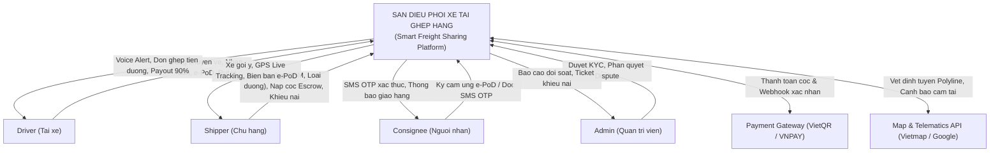

# Smart Freight Sharing Platform (B2B/C2C Logistics Marketplace)

Business Analysis & Product Specification Portfolio  
Author: Business Analyst (Fresher++ / Junior)  
Domain: Supply Chain / Domestic Road Freight Transportation (Less-Than-Truckload - LTL)  
Interactive Prototype Demo: [Live Web Prototype](prototype_freight_sharing.html)


 1. Executive Summary & Problem Statement (BACCM)

- **Context:** In domestic inter-provincial road freight transport, long-haul trucks frequently experience 50% to 70% empty return trips (deadhead miles) after initial delivery, wasting fuel and operational costs.
- **Core Problem:** Small/LTL shippers pay high fees for full truck rentals or slow postal consolidation, while return-trip truck drivers lack a reliable platform to find cargo along their return corridor.
- **Solution:** A two-sided freight matching marketplace integrating Multi-factor Smart Matching, Anti-Fraud Electronic Proof of Delivery (e-PoD), and Fintech Escrow Payment Custody with a 24-hour Auto-Disbursement Engine.


 2. System Context Diagram (DFD Level 0)



 3. End-to-End Business Workflow

```mermaid
flowchart TD
    A[1. Tai xe kich hoat Chuyen ve & Chu hang tao don] --> B[2. Thuat toan quet: Check W, V, Lech tuyen <=10km, Loai duong]
    B --> C{Co xe phu hop?}
    C -- Co --> D[3. Chu hang chon xe & Khoa 100% coc vao Quy Escrow Vault]
    C -- Khong --> E[Dang don len san cho PENDING]
    D --> F[4. Tai xe lay hang, chup anh doi chung -> IN_TRANSIT]
    F --> G[5. Den noi -> Check GPS <=200m -> Chup 2 anh -> Ky e-PoD -> DELIVERED]
    G --> H[6. Kich hoat bo dem nguoc 24h Escrow tu dong]
    H --> I{Trong 24h co Khieu nai?}
    I -- KHONG co khieu nai --> J[Tu dong tru 10% phi san -> Giai ngan 90% vao Vi Tai xe -> COMPLETED]
    I -- CO khieu nai --> K[Dong bang Escrow (FROZEN_DISPUTE) -> Admin doi soat anh phan xu]


 4. Detailed Core Use Cases & Business Rules

### UC-01: Smart Matching Engine & Escrow Lock
- **Matching Criteria:** Checks payload weight (kg), volumetric weight (CBM), and route corridor detour within 10 km buffer zone.
- **Road Accessibility Filter (FN-02.1B):** Automatically filters out Container Trucks (> 5 tons) if the Shipper indicates a narrow alley destination (<= 2.5 tons only), providing an alternative "Roadside Gas Station Drop-off" option.
- **Escrow Pre-authorization:** 100% of freight fee is locked upon match confirmation via Dynamic VietQR / Bank Card gateway.

### UC-02: Electronic Proof of Delivery (e-PoD)
- **3-Factor Verification:**
  1. **GPS Geofencing:** Validates driver device distance is <= 200 meters from destination. Includes Anti-Mock Location check to prevent fake GPS apps.
  2. **Live Camera Capture:** Enforces live camera capture (>= 2 photos) and disables gallery upload.
  3. **Digital Signature:** Touchscreen finger signature with SMS OTP fallback if recipient is absent.
- **Offline-First Sync:** Stores encrypted proof locally during network outages and auto-syncs when 4G reconnects.

### UC-03 & UC-04: 24-Hour Escrow Settlement & Dispute Arbitration
- **Settlement Formula:**
  - Driver Net Payout = 90% of Total Freight Fee
  - Platform Commission Fee = 10% of Total Freight Fee
- **Dispute Freezing:** Instant freeze of the 24-hour countdown upon complaint submission. Admin audits baseline pick-up photos vs. drop-off e-PoD photos to rule refund or payout within a 48-hour SLA.


 5. Data Model Entities (High-Level ERD)

1. `Users`: user_id, phone_number, full_name, role (SHIPPER, DRIVER, ADMIN), wallet_balance.
2. `Vehicles`: vehicle_id, driver_id, plate_number, truck_type, max_weight_kg, max_cbm, dimensions_LxWxH.
3. `Trips`: trip_id, driver_id, origin, destination, route_polyline, etd, available_weight_kg, available_cbm, trip_status.
4. `Orders`: order_id, shipper_id, pickup_address, dropoff_address, weight_kg, cbm, road_access_type, shipping_fee, order_status.
5. `ePoD_Records`: epod_id, order_id, delivery_gps_lat, delivery_gps_long, proof_photo_urls, signature_image_url, delivered_at.
6. `Escrow_Transactions`: escrow_id, order_id, total_amount, commission_fee, driver_payout_amount, escrow_status, auto_disburse_at.


 6. Repository Artifacts

- `Context_Diagram.drawio`: Complete System Context DFD Level 0 diagram.
- `Workflow_Diagram.drawio`: End-to-End multi-phase Business Workflow diagram.
- `Activity_Diagrams.drawio`: Multi-page Swimlane Activity Diagrams for Matching, e-PoD, and Escrow.
- `prototype_freight_sharing.html`: Standalone interactive prototype demo (HTML5, Vanilla CSS, JS).
